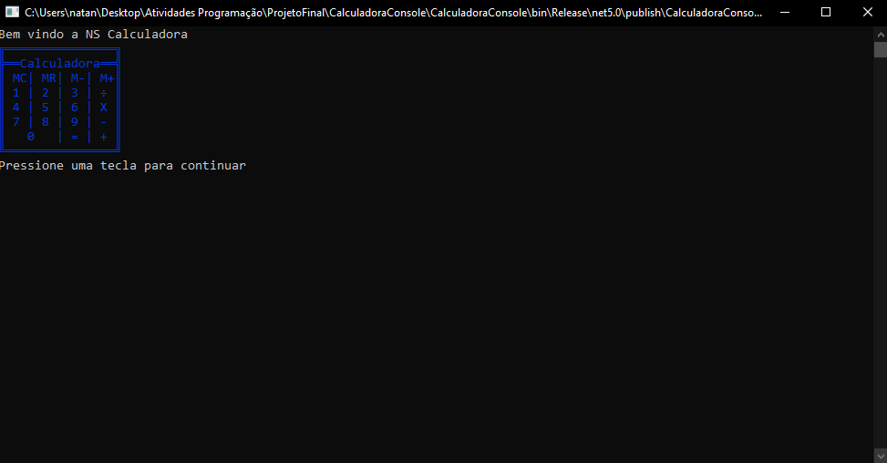
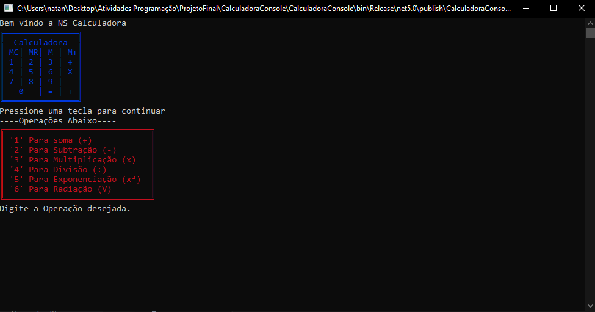
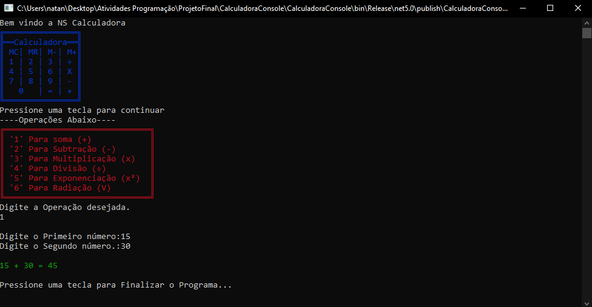

# Calculadora NS
Bem Vindo a nossa Calculadora


Esse Programa Realiza Cálculos, Temos nele 6 tipos de Operação
Sendo eles: Soma, Subtração, Multiplicação, Divisão, Exponenciação e Radiação.


## Exemplo

```
▼▼▼Essas são as Operações da Calculadora NS▼▼▼

'1' Para soma (+)
'2' Para Subtração (-)
'3' Para Multiplicação (x)
'4' Para Divisão (÷)
'5' Para Exponenciação (x²)
'6' Para Radiação (V)
```

Dentro da Calculadora você digita a operação desejada. 
Logo após a seleção, será solicitado os números para o cálculo. 

Ex:

```
Digite o Primeiro número..: 4
Digite o Segundo número...: 13
```

Então, logo após a digitação dos números, o Resultado será exibido.

Ex:

```
 4 + 13 = 17
```

## _Screenshots_
Aqui Temos a Tela Inicial.



Aqui Temos a Parte da seleção de Operações



E Aqui um print com o Calculo já Realizado



## _Download_
Clique Aqui Para Fazer o Download da Calculadora NS

[🔽 Download CalculadoraNS .zip](dist/CalculadoraConsoleNS.zip)

## Como usar o Programa ?
Depois de fazer o Download, Extraia os arquivos para a pasta desejada.


Se Estiver no Windows basta dar duplo clique no arquivo 
```
"CalculadoraConsole.exe"
```
Se estiver em outro Sistema Operacional, Execute usando o comando:
```
dotnet CalculadoraConsole.dll
```

## Agradecimentos
- [Prof. Ermogenes](https://github.com/ermogenes)
- [Prof. Neri](https://github.com/diegoneri)
- [Etec Adolpho Berezin](http://eteab.com.br/cms/)
